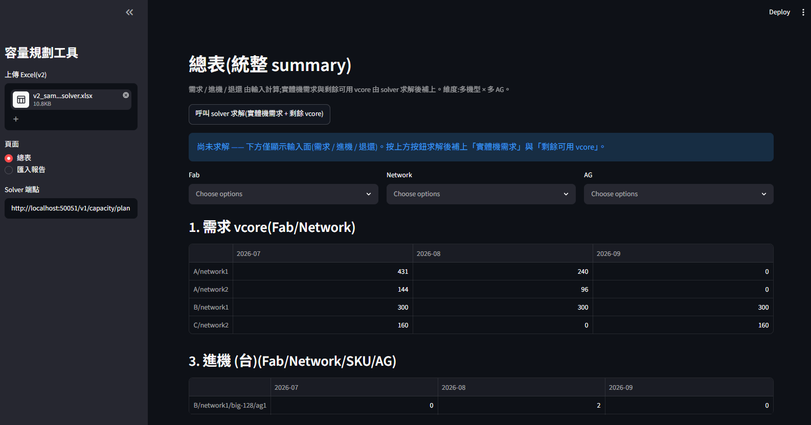
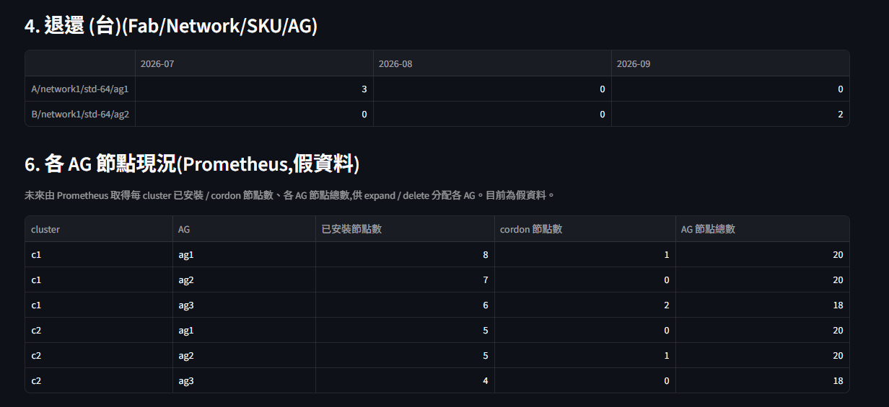

# 容量規劃工具 —— v2(整合 solver)設計說明

本版方向:**工具收斂成「Excel I/O + UI 層」,規劃求解交給同事的 CP-SAT solver**
(`solve_capacity_horizon`,HTTP `/v1/capacity/plan`)。工具負責:與 PM / 硬體 team 的
Excel 溝通、輸入模型、以及把 solver 的結果統整成一張 summary。

分支:`integrate-solver`。設計 spec 見 `docs/superpowers/specs/2026-07-25-solver-integration-control-plane-design.md`。

---

## 1. 架構

```
Excel(v2)──import_v2──► PlanInput ──horizon_adapter──► CapacityPlanRequest(JSON)
                                                              │ HTTP POST
                                             同事 solver /v1/capacity/plan
                                                              │ CapacityReport
                          summary.capacity_summary ◄──────────┘
                                    │
                              Streamlit「總表」(5 區塊 + 維度 filter)
```

- `captool/importer.py` —— 解析 v2 Excel → `PlanInput`
- `captool/solver/horizon_adapter.py` —— `PlanInput → CapacityPlanRequest`、POST、
  `CapacityReport → HorizonResult`(依賴注入 `solve_fn`,工具本身不裝 ortools)
- `captool/summary.py` —— 統整 5 區塊
- `app/streamlit_app.py` —— UI(單一「總表」頁 + 匯入報告)
- solver 為獨立專案(`solver-develop/`,gitignore),走 HTTP

## 2. Excel v2 格式

### 各廠區 tab(A / B / C …)—— 需求區(A 欄起)

| 欄 | 內容 |
|---|---|
| A | Product(worker 產品名 / new build 的 cluster 名) |
| B | BM Group(= network) |
| C | VM vcore(空=粗粒度 worker;有值=每顆 VM 尺寸) |
| D | 爆炸半徑 (1:x)(一台實體機最多住幾顆;空=不限) |
| E | Tenant(自由=留空 / 指定群組名 / 獨佔) |
| F | **Menu**(`Worker` = 一般需求列;`A`~`E` = new build,引用 Cluster_Menu) |
| G 起 | 各月數值(worker 列=vcore;new build 列=當月建幾個 cluster) |

退還區(同頁,T 欄起):`Product(T) | BM Group(U) | 機型(V) | ag(W,選配) | 月份(X 起)`

### 硬體 / 拓撲表

- `HW_SKU`:`name, vcore_per_node, usable_ratio`
- `HW_Current`:`fab, bm_group, sku, count, ag`(**每台在庫機器帶 AG**)
- `HW_MoveIn`:`fab, bm_group, sku, month, count, ag`(ag 選配;空=solver 自選落點)
- `HW_Caps`:`fab, network, ag, max_bm`(每個 AG 採購槽位上限;**並宣告有哪些 AG**,
  含目前沒機器的空 AG —— control plane master×5 需 ≥5 個 AG 才分得開)
- `Cluster_Menu`:`menu, role, count, co_residency, vm_vcore`(new build 菜單目錄 A~E)

### 語意

- 失效域 = **AG**;solver 把 masters / workers 都跨 AG 分散(HA / 爆炸半徑)。
- new build 列的月份 = 當月建幾個 cluster;cluster 名 = Product;角色由菜單展開。
- worker 粗粒度(C 空)整包 vcore 給 solver 切;detail(C 有值)固定顆數 × 尺寸。

## 3. 總表(summary)—— 五區塊 + filter

上傳 → 「總表」→ 按「呼叫 solver 求解」。維度:多機型 × 多 AG。




| 區塊 | 維度 | 來源 |
|---|---|---|
| 1. 需求 vcore | Fab / Network | 輸入(coarse + detail) |
| 2. 實體機需求-採購 (台) | Fab / Network / **SKU** / AG | solver `budget_view`(各 SKU 採購台數) |
| 3. 進機 (台) | Fab / Network / SKU / AG | 輸入(HW_MoveIn) |
| 4. 退還 (台) | Fab / Network / SKU / AG | 輸入(HW 退還區,選配 ag) |
| 5. 剩餘可用 vcore(月末) | Fab / Network / AG | solver(cell in_stock_available) |
| 6. 需求 ↔ 供給機型對照 | Fab / Network / **SKU** | solver `budget_view` + 輸入(需求產品、in-stock 既有台數) |
| 7. 各 AG 節點現況 | cluster / AG | Prometheus(**未來,目前假資料**) |

**維度 filter**:頁上有 Fab / Network / AG 三個多選,空=全顯示;AG filter 只作用於有 AG 維度的區塊。

設計決定(與「全維度 Fab×Network×SKU×AG」相比):
- **需求 vcore 無 SKU/AG** —— 需求本質是某 network 的整包 vcore。
- **實體機需求以「採購台數」呈現(可分 SKU)** —— solver 回的在庫使用數不分 SKU,
  只有採購(budget_view)分 SKU;採購才是可執行的「要買什麼」。
- **剩餘庫存以 vcore 而非台數** —— 多機型 + 共居下一台機住多顆 VM 仍是一台,
  台數不再良好定義,剩餘可用 vcore 才有意義。
- **需求↔供給只到 network 層(區塊 6)** —— network 是硬分區(需求輸入即帶),同
  network 需求共用機器池;solver 的 `budget_view` 最細只到 (fab, network, AG, 月, SKU),
  **沒有 cluster/demand 欄位**(solver 決議 #21/#37 刻意不做逐需求)。逐 cluster→SKU 需另呼叫
  `/v1/placement/split-and-solve` 逐 VM 求解,且分配是任意 tie-break、語意模糊,故不採。

## 4. 執行面需求單(單月,procure)

規劃面(§3 總表)給你 + PM 看**多月整體方向**;**執行面需求單**是另一回事 ——
只在**月底整理「下個月已確定需求」時**才產生,交給執行工程師照著備料。

- **端點**:走 solver **單期** `/v1/capacity/procure`(不是多月 `plan`)。它回傳
  `assignments`(逐 VM→BM)+ `bought_type_of`(bought bm→SKU),所以逐需求 → SKU 是
  **真實落點,不是估算分攤**。逐需求歸屬靠 `ResourceRequirement.cluster_id` +
  synthetic VM id `split-r{idx}` 對回我方送出的順序 —— **無跨團隊相依,不需 solver 端改**。
- **UI**:「執行面需求單」頁 → 選目標月 → 產生。輸出兩張表 +「下載需求單 (xlsx)」:
  1. **需求單**(每列一個需求):`Demand | VM 規格×台 | 建議實體機(SKU×台,其中新採購) | Due`
  2. **實際採購清單**(去重,下單依據):`Fab | Network | SKU | 採購台數`
- **in-stock 起點** = 現況 + 到目標月(含)的進機 − 退還。
- **共用注意**:一台實體機可同住多需求的 VM,所以「建議實體機」台數**跨需求會重複計**;
  真正要下的採購以**去重採購清單**為準。
- 程式:`captool/solver/procure_adapter.py`(`demand_order` / `demand_order_frames`)、
  匯出 `captool/exporter.py::export_demand_order`。

> 規劃(方向) vs 執行(單月落地)分離,也化解了「多月批量預購 vs 逐月分攤」的疑慮 ——
> 執行面是單月確定需求,不做跨月分攤。

## 5. 安裝與執行

### 4.1 安裝(本工具)

需要 Python 3.12+。在專案根目錄:

```bash
# Windows (PowerShell)
python -m venv .venv
.venv\Scripts\python.exe -m pip install -r requirements.txt
```

```bash
# macOS / Linux
python3 -m venv .venv
.venv/bin/python -m pip install -r requirements.txt
```

依賴(`requirements.txt`):`openpyxl`、`pandas`、`streamlit`、`pytest`。
本工具**不含** ortools —— 求解走 HTTP 打同事的 solver(見 4.3)。

### 4.2 啟動 UI

```bash
# Windows
.venv\Scripts\python.exe -m streamlit run app\streamlit_app.py
```

```bash
# macOS / Linux
.venv/bin/python -m streamlit run app/streamlit_app.py
```

瀏覽器開 `http://localhost:8501` → 左側上傳 Excel → 「總表」→ 按「呼叫 solver 求解」。
範例輸入:`examples/v2_sample_solver.xlsx`(統一版面、各情境、HW 帶 AG、菜單 A~E);
產生器:`examples/gen_v2_solver_sample.py`。

> 改動 `captool/` 的 model / 函式後,長跑的 Streamlit 會抱著舊模組快取 —— 重啟即可(見 §6)。

### 4.3 啟動 solver(同事的獨立專案)

solver 為**獨立 repo**(`solver-develop/`,本專案 gitignore、不隨本包上傳),需另行取得並自行架設。
她的 `pyproject` 標 `requires-python≥3.13`;若用 3.12,直接裝依賴繞過版本限制即可:

```bash
# 在 solver-develop/solver-develop/ 下,建議獨立 venv
pip install ortools pydantic fastapi uvicorn swagger-ui-bundle "pandas==2.3.3"
PYTHONPATH=. python -m app.server --port 50051
```

UI 左側「Solver 端點」預設 `http://localhost:50051/v1/capacity/plan`,對齊上面的 port。

### 4.4 測試

```bash
.venv\Scripts\python.exe -m pytest      # Windows
.venv/bin/python -m pytest              # macOS / Linux
```

## 6. 現況與待辦

**已完成(worker 路徑,live 驗證)**:v2 匯入(統一版面 + Menu 欄 + AG)、horizon adapter、
規劃面 summary(區塊 1–6,含需求↔供給機型對照)+ filter、**執行面需求單(單期 procure,
逐需求真實落點 + xlsx)**。85 tests。

> 註:原本要請同事在多月報表曝露 assignment,後來發現**單期 `procure` 端點本來就回 assignments**,
> 執行面需求單直接用它即可 —— 該跨團隊需求已作廢。

**待辦**:
- **control-plane 菜單展開成 solver request** —— 卡在 §6.2:solver 的 `NodeRole` enum 只有
  master/worker/infra/l4lb,菜單的 learner/F5/Bastion/HA/VT 不在內;加上 co-tenancy(共住/獨佔)
  表達,需與同事對齊 role / tenant 對應。new_builds 目前已擷取但未送 solver。
- **爆炸半徑 / Tenant 約束** —— 目前只送需求量,未下 `max_per_bm` / 共居候選約束(同 §6.2)。
- moveins / returns → `committed_stock` 的時序對應;worker `vm_specs` 來源(目前固定 8-core)。
- Prometheus 整合(區塊 6 目前假資料)。

## 7. 開發注意

改動 `captool/` 的 model 或新增函式後,長跑的 Streamlit server 會抱著**舊模組快取**,
出現 `AttributeError` / `cannot import name` —— **重啟 `streamlit run` 即可**。
